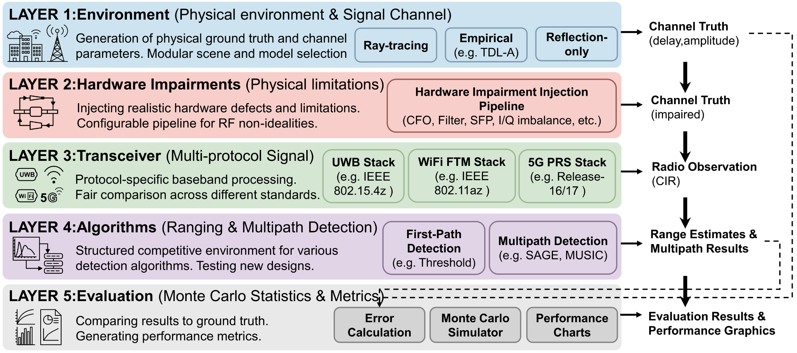
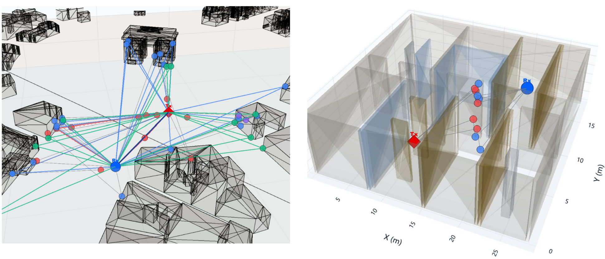
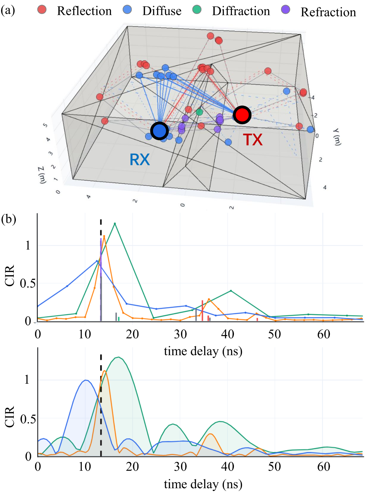
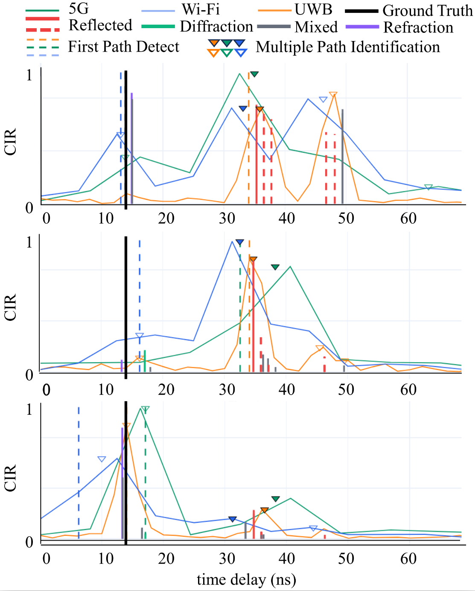
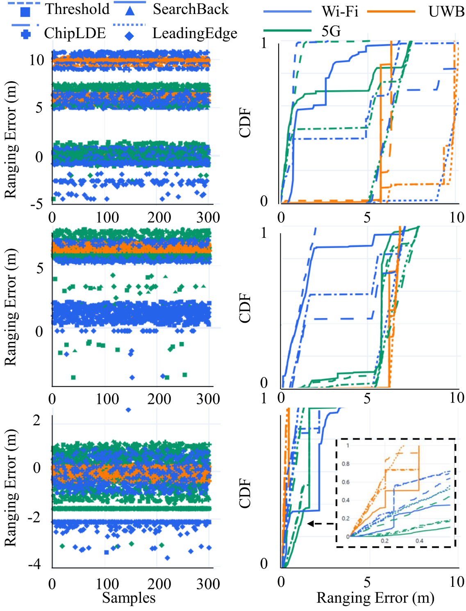
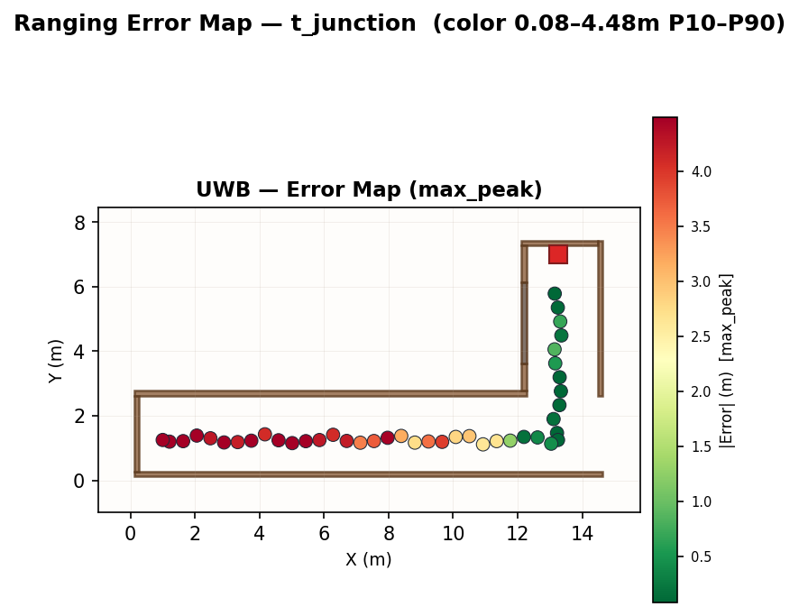
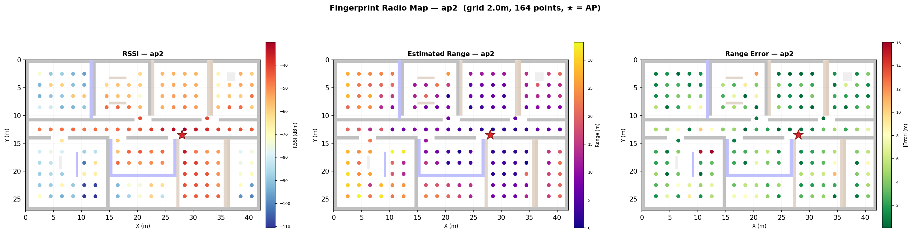

# RadioRange-Sim

**RF Ranging Error Simulation** — ray-tracing channel modeling, chip-level impairments, and first-path detection algorithms for UWB, WiFi, and 5G NR.

[](LICENSE)
[](https://www.python.org/)
[]()

---

> **New to RF positioning?** Wondering how radio waves translate into distance measurements — and why off-the-shelf telecom simulators never quite capture what matters for localization error?
>
> **Researching RF localization?** Need a fair, reproducible way to benchmark first-path detection, multipath identification, and ranging error across UWB, WiFi, and 5G — all on the same physical channel?
>
> **Building multi-sensor fusion for robots?** Want to introduce global positioning (UWB / WiFi / 5G) into GNSS-denied environments, but unsure how to model realistic ranging errors without becoming an RF expert?
>
> **Working on fingerprint-based indoor localization?** Tired of walking the floor over and over to collect RSSI surveys, and wish you had an accurate simulation environment to evaluate your method first?

**RadioRange-Sim answers all four.**

---

## Overview

RadioRange-Sim is an end-to-end, **positioning-first** simulation framework for evaluating RF ranging accuracy. It models the full pipeline from radio wave propagation to baseband signal processing:

```
Channel (RT / TDL)  →  Hardware Impairments  →  Radio Observation (CIR)  →  LDE Algorithm  →  Range Error
```

All three protocols — UWB, WiFi, and 5G — are placed on the **same physical channel**, enabling fair, reproducible cross-protocol comparison. A unified CIR-based algorithm interface makes every LDE (Leading-Edge Detection) algorithm work identically across all protocols.


*Fig. 1 — Five-layer system architecture. The pipeline flows unidirectionally through Environment → Hardware Impairments → Transceiver → Algorithms → Evaluation, with three immutable data structures (ChannelTruth, RadioObservation, RangeEstimate) enforcing clean separation between layers.*

### Key Features

| Category | Detail |
|----------|--------|
| **Protocols** | UWB Impulse Radio (802.15.4), WiFi OFDM (802.11), 5G NR |
| **Scenes** | 13+ presets: statistical TDL (A–E), Sionna ray-tracing (box, knife-edge, Munich, Etoile, Florence), procedural rooms, custom floorplan images |
| **Impairments** | 7 toggleable hardware impairments (SFO, CFO, antenna PCV, IQ imbalance, AGC, ADC quantization, ADC timing) + 4 OFDM observation effects (CSI noise, channel estimation, DMRS, common phase error) |
| **Algorithms** | 5 LDE (MaxPeak, Threshold, LeadingEdge, SearchBack, ChipLDE) + 3 multipath (PeakFinder, CA-CFAR, CLEAN) |
| **Modes** | 8 experiment modes: interactive, measure, fingerprint, single, compare-algos, compare-materials, rt-viz, ablation |
| **Visualization** | One-command interactive 3D HTML reports with ray paths, CIR, CDF, and algorithm overlays |

### What It Looks Like


*Fig. 2 — 3D ray-traced environment visualization: outdoor urban and indoor multipath propagation using Sionna RT's Shooting-and-Bouncing Rays (SBR) engine with frequency-dependent Fresnel material interactions.*


*Fig. 3 — CIR comparison across protocols: UWB (~2 ns resolution), WiFi (~6.3 ns), and 5G NR (~8.1 ns) continuous CIR curves overlaid on the same delay axis. The gray dashed line marks the clean (noiseless) CIR; the vertical marker shows the ground-truth first-path delay τ₀. UWB's wider bandwidth gives it visibly superior multipath resolvability.*


*Fig. 4 — First-path detection and multipath identification overlaid on CIR. Three stacked panels show qualitatively different channel conditions (varying TX-RX geometry and multipath complexity), with algorithm first-path estimates marked per protocol and detected paths color-coded by interaction type (Reflection, Diffraction, Refraction).*



*Fig. 5 — Ranging error CDF comparison. Four sub-panels arranged in a 2×2 grid: protocol-level comparison (UWB vs. WiFi vs. 5G) and algorithm-level comparison (Threshold, SearchBack, ChipLDE, LeadingEdge) under various impairment conditions. Inset zoom boxes magnify the P10–P90 region for finer discrimination.*

---

## Core Capabilities

RadioRange-Sim provides two powerful end-to-end modes designed for **integrated navigation** and **indoor localization** research.

### Measure — Trajectory-Based Ranging Simulation

Simulate ranging along a user-provided walking trajectory on any floorplan. The simulator ray-traces every TX–RX pair along the path, applies hardware impairments, runs LDE algorithms, and outputs range errors with full visualization.



*Fig. 6 — Measure mode output for a T-junction scene. Clockwise from top-left: error map overlaid on floorplan, error vs. distance, error CDF, and gridded error heatmap.*

**Two entry paths:**

```bash
# Built-in demo — no files needed
radiorange --mode measure --trajectory-scene corridor --radios uwb
radiorange --mode measure --trajectory-scene t_junction --radios uwb --impairments full

# Custom floorplan + trajectory (your own PNG + CSV)
radiorange --mode measure \
           --floorplan-image my_office.png \
           --waypoints-file trajectory.csv \
           --floorplan-width-m 15.0 \
           --tx 2 1.5 1.5 \
           --radios uwb --impairments full
```

Output: `outputs/measure/<scene>_<ts>/` — error map, error vs. distance, CDF, CSV results, RMSE summary.

> See **[MODES.md](MODES.md#measure)** for full measure customization (built-in scenes, CSV format, algorithm selection, impairments).

### Fingerprint — WiFi RSSI/RTT Radio Map Generation

Generate a dense WiFi fingerprint radio map on a floorplan grid. Given a PNG floorplan and AP positions, the simulator runs Sionna ray-tracing at every grid point × AP pair, computes **RSSI from multipath channel gains** and **range estimates via LDE**, then produces per-AP visualization panels.


*Fig. 7 — Fingerprint radio map for a complex building with 2 auto-placed APs (★). Three panels per AP: RSSI heatmap (dBm), estimated range (m), and range error (m).*

```bash
# Default — 2 auto-placed APs, 2 m grid
radiorange --mode fingerprint \
           --floorplan-image floorplans/complex_building.png \
           --floorplan-width-m 42

# Custom AP positions + full settings
radiorange --mode fingerprint \
           --floorplan-image floorplans/complex_building.png \
           --floorplan-width-m 42 \
           --aps floorplans/complex_building_aps.csv \
           --grid-spacing 2.0 --tx-power 20 \
           --algo leading_edge --impairments none
```

Output: `outputs/fingerprint/<name>_<ts>/` — per-AP radio maps (RSSI + Range + Error panels), `fingerprint_db.csv`, `metadata.json`.

> See **[MODES.md](MODES.md#fingerprint)** for full fingerprint customization (AP placement, grid density, algorithm selection, GPU acceleration).

---

## Quick Start

### 1. Install

```bash
# Core install (TDL channels + UWB, no Sionna required)
git clone https://github.com/Togure/RadioRange.git
cd radiorange-sim
pip install -e .
```

```bash
# Full install (ray-tracing, OFDM, 3D visualization)
pip install -e ".[sionna]"
```

> **Note:** Sionna requires TensorFlow (~2 GB). The core install is sufficient for statistical channels and UWB radio.

### 2. Run Interactive Visualization

The fastest way to see what the simulator does — one command generates four interactive 3D HTML reports:

```bash
radiorange --mode interactive
```

```
outputs/interactive/
├── box_knife_chip_sim.html        # Box + Knife-Edge (NLOS)
├── box_chip_sim.html              # Simple Box (LOS)
├── etoile_chip_sim.html           # Etoile / Arc de Triomphe (Urban LOS)
└── complex_building_chip_sim.html # Custom floorplan building
```

Open any `.html` file in a browser. Each report contains:
- **3D scene** with traced ray paths (color-coded by propagation type)
- **CIR panel** — clean vs. observed channel impulse response
- **Multipath identification** — algorithm-detected paths vs. ground truth
- **CDF panel** — ranging error distribution per protocol

---

## Other Modes

All modes share the same CLI options (`--radios`, `--scene`, `--algo`, `--impairments`, `--trials`). See **[MODES.md](MODES.md)** for customization details and advanced usage.

```bash
# Default mode — single scene, produce CIR + error plots
radiorange --scene tdl_a --radios uwb --algo threshold --trials 200

# Compare all 5 LDE algorithms on one scene
radiorange --mode compare-algos --scene tdl_a --radios all --trials 100

# Sweep wall materials, measure per-material range error
radiorange --mode compare-materials --radios all --trials 50

# Single-scene 3D HTML from a pre-computed RT cache
radiorange --scene box --radios uwb --dump-truths cache/rt/my_box
radiorange --mode rt-viz --from-cache cache/rt/my_box --radios uwb --trials 100

# Impairment ablation — measure Δ RMSE per impairment
radiorange --mode ablation --ablation-mode ablation --trials 100
```

---

## Citation

If you use RadioRange-Sim in your research:

```bibtex
@software{radiorange_sim,
  author = {Lyu, Zhen},
  title = {RadioRange-Sim: RF Ranging Simulation Framework},
  year = {2026},
  url = {https://github.com/Togure/RadioRange},
}

@inproceedings{RadioRange,
  title={RadioRange: An Open-Source Digital Twin-based Ranging Simulator for UWB, Wi-Fi, and 5G},
  author={Lyu, Zhen, et.al.},
  booktitle={on going...},
  pages={},
  year={},
  organization={IEEE}
}

@article{lyu2025wi,
  title={Wi-Fi RTT Indoor Positioning Using Visibility Matching With NLOS Receptions},
  author={Lyu, Zhen and Bai, Shiyu and Wang, Xin and Li, Lin and Zhang, Guohao},
  journal={IEEE Internet of Things Journal},
  volume={12},
  number={12},
  pages={18779--18790},
  year={2025},
  publisher={IEEE}
}

@article{wang2026r,
  title={R 2 TT: High-Accuracy 3D Localization Using Ray-Tracing-Based Wi-Fi RTT Virtual Fingerprints for Challenging Scenarios},
  author={Wang, Xin and Liu, Xikun and Lyu, Zhen and Xu, Ruijie and Wen, Weisong},
  journal={IEEE Transactions on Mobile Computing},
  year={2026},
  publisher={IEEE}
}


```

---

## License

MIT — see [LICENSE](LICENSE).
